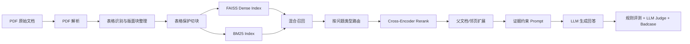

# 系统架构与模块选型

## 总体架构



## 模块说明

### 1. PDF 解析

参考 RAGFlow DeepDoc 的处理思路，优先处理金融 PDF 的三个难点：

- 多栏排版导致阅读顺序错乱。
- 表格区域容易被普通文本切块破坏。
- 同一页中标题、正文、表格、脚注混排。

当前实现位于：

- `src/financial_report_rag/parsing/pdf_parser.py`
- `src/financial_report_rag/parsing/table_structure.py`
- `scripts/data/parse_pdfs.py`

### 2. 表格保护切块

普通固定长度切块容易把财务表格行切断，导致“2026E / 营收 / 百万元”这类字段和数值分离。项目实现了表格保护策略：

- 表格作为特殊块处理。
- 表格行不被普通 overlap 切断。
- chunk metadata 保留 `has_table`、来源文档和页码。

当前实现位于：

- `src/financial_report_rag/processing/chunker.py`
- `scripts/processing/build_chunks.py`

默认切块参数为 `chunk_size=512, overlap=100`。切块实验见 [experiments/chunking/chunking_experiment.md](experiments/chunking/chunking_experiment.md)。

### 3. 向量索引与 BM25

向量检索使用：

- embedding：`bge-large-zh-v1.5`
- vector store：FAISS Flat
- dimension：1024

关键词检索使用：

- tokenizer：`jieba`
- retriever：BM25

当前实现位于：

- `src/financial_report_rag/retrieval/embeddings.py`
- `src/financial_report_rag/retrieval/vector_store.py`
- `src/financial_report_rag/retrieval/bm25_store.py`

为什么当前默认使用 FAISS Flat：

- 全量 chunk 数只有 6826，Flat 延迟已经很低。
- IVF/HNSW 在当前数据规模和参数下召回下降明显。
- Flat 更适合作为可解释、稳定的实验 baseline。

### 4. 混合召回

单纯向量检索对数字、公司简称、财务指标别名不够稳定；单纯 BM25 又容易漏掉语义相近表达。因此默认使用：

```text
hybrid = 0.6 * dense_score + 0.4 * bm25_score
```

当前实现位于：

- `src/financial_report_rag/retrieval/hybrid_retriever.py`

混合召回从 `Recall@5=78.25%` 的纯向量 baseline 提升到 `Recall@5=81.54%`。

### 5. Rerank 与父子文档

参考 QAnything 的 two-stage retrieval 思路：

1. 第一阶段用 hybrid retrieval 召回较大的候选池。
2. 第二阶段用 Cross-Encoder reranker 精排。
3. 最后扩展到父文档或邻页，避免证据上下文被切得过碎。

当前实现位于：

- `src/financial_report_rag/retrieval/reranker.py`
- `src/financial_report_rag/retrieval/parent_document.py`

### 6. 按问题类型路由

最终检索不是“一套参数打天下”，而是按问题类型使用不同策略：

| question_type | strategy |
|---|---|
| fact | hybrid Top5 + parent window |
| compare | query rewrite + entity slots + rerank + parent fill + parent window |
| summary | hybrid Top50 + source diverse Top8 + parent window |

这样做的原因：

- fact 需要精确数字，候选越多反而会干扰生成。
- compare 需要同时保障两个实体的证据命中。
- summary 需要跨文档覆盖，必须扩大候选池并做来源多样性约束。

当前实现位于：

- `src/financial_report_rag/retrieval/routed_retriever.py`
- `scripts/evaluation/evaluate_routed_retrieval.py`
- `scripts/generation/generate_answers.py`

### 7. 生成与评测闭环

生成阶段使用证据约束 Prompt：

- 只能依据检索资料回答。
- 必须保留关键数字、口径和时间。
- 每个结论尽量绑定 `[资料X]`。
- 资料不足时拒答，但已有直接证据时不能轻易拒答。

评测分为三层：

| layer | 作用 |
|---|---|
| retrieval metrics | 评估 evidence doc/page 是否命中 |
| rule-based generation metrics | 评估引用、数字覆盖、可回答率 |
| LLM Judge | 对比生成答案与 ground truth，给出正确率和原因 |

当前实现位于：

- `src/financial_report_rag/generation/prompt_builder.py`
- `src/financial_report_rag/generation/context_formatter.py`
- `scripts/generation/generate_answers.py`
- `scripts/evaluation/evaluate_generation.py`

## 当前正式配置

```text
chunk: chunks_boundary.jsonl
index: data/processed/indexes/bge_large_zh_v15/faiss_flat.index
bm25: data/processed/indexes/bge_large_zh_v15/bm25.pkl
embedding: models/bge-large-zh-v1.5
reranker: models/bge-reranker-v2-m3
compare rewrite: data/processed/query_rewrites/compare_financial_table_no_unit_rule.jsonl
```

## 当前局限

- summary 题仍然是短板，主要受跨文档覆盖、答案风格和 judge 标准影响。
- 部分 fact 错误来自 PDF 表格解析或财务表字段读取。
- 生成模型和代理服务稳定性会影响全量实验耗时。
- 当前索引规模较小，尚未引入 Milvus 等服务化向量库。
